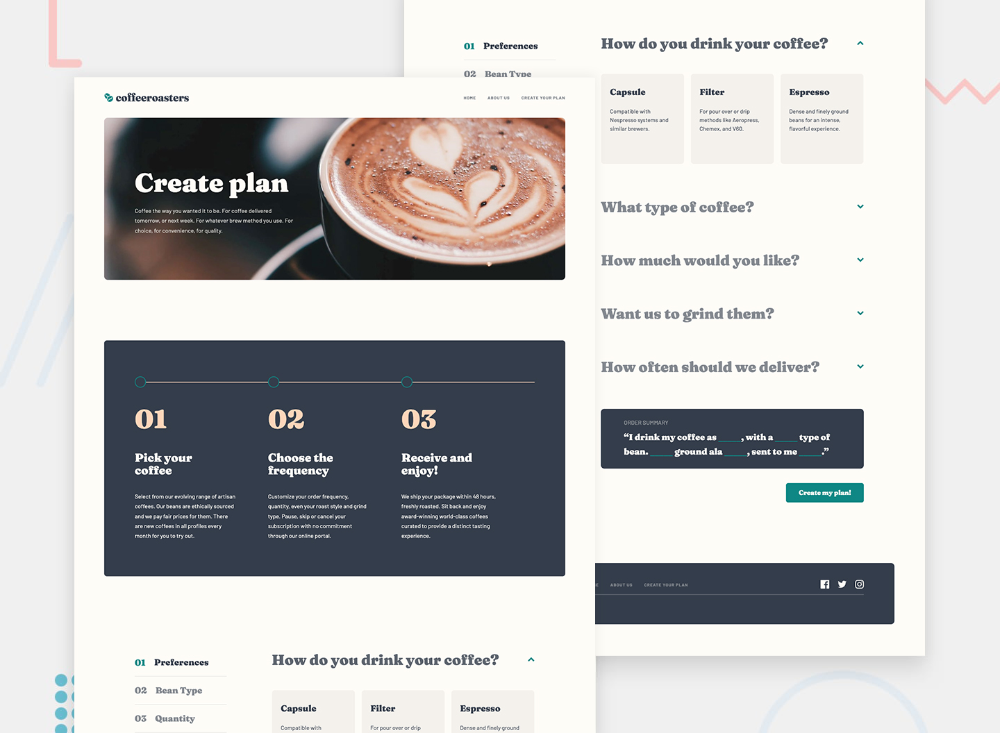

# Frontend Mentor - Coffeeroasters subscription site solution

This is my solution to the [Coffeeroasters subscription site challenge on Frontend Mentor](https://www.frontendmentor.io/challenges/coffeeroasters-subscription-site-5Fc26HVY6).

## Table of contents

- [Overview](#overview)
  - [The challenge](#the-challenge)
  - [Screenshot](#screenshot)
  - [Links](#links)
- [My process](#my-process)
  - [Built with](#built-with)
  - [Useful resources](#useful-resources)
- [Author](#author)

## Overview

### The challenge

Users should be able to:

- View the optimal layout for each page depending on their device's screen size
- See hover states for all interactive elements throughout the site
- Make selections to create a coffee subscription and see an order summary modal of their choices
- **Bonus**: See a loading state while the content of each page is loading

### Screenshot

#### Home page

#### About Us page

#### Create Plan page

### Links

- Solution URL: 
- Live Site URL: 

## My process

### Built with

- Semantic HTML5 markup
- Mobile-first approach
- CUBE CSS methodology
- CSS custom properties
- [TypeScript](https://www.typescriptlang.org/)
- [React](https://reactjs.org/) - JS library
- [Sass](https://sass-lang.com/)

### What I learned

I have been learning `React` since the beginning of 2022 and this challenge was a great opportunity for me to put what I've learnt into practice:

- **Component composition**
  - It promotes the reusability of components.
  - It helps to define between container and presentational components.
  - It helps to avoid prop drilling.
- **Styling components using `CSS` modules**
  - It allows the scoping of `CSS` by automatically generating unique classnames.
- **Custom `React` hooks**
  - I created a `useContent` hook to handle the fetching of page content, catching errors and transitioning of state.
- **Handling forms and user inputs**
- **Handling HTTP request and response**
  - Even if the challenge is to build a static website, I wanted to know how to handle the content in a scenario where it would be fetched from a server. I discovered `Axios Mock Adapter` which proves to be a useful tool to mock requests when building application and you do not have a backend to serve the data.
- **Routing with `React Router`**
- **Unit testing components with `React Testing Library`**
  - Testing small and isolated components in an entire `React` application helps in building confidence that each component is doing what it is expected to do and also helps in the process of adding new features and refactoring without breaking anything
- **End-to-end testing with `Cypress Testing Library`**
  - Testing the whole application from start to finish from the end user's perspective by simulating real-world scenarios is also important as it ensures that all the isolated pieces of the application work together as expected and makes it simpler to catch bugs before the application is released
- In general for any given project, writing tests is the part that I enjoy the less. However, as the project grows, I realised that tests (unit/E2E) are essential to prevent bugs and regressions. It is the first time that I use `Testing Library` and I must say that the experience in `React` is far better if for example compared to using `Jasmine` and `Karma` in an `Angular` application. It encourages you to focus on testing the components in the way the users would be interacting with the them rather than testing their implementation details. This also encourages you to make the application more accessible because the test cases are written by querying the `DOM` by text or by element roles

### Useful resources

- [Mocking your requests like a pro](https://www.sergiojunior.com.br/en/mocking-your-requests-like-a-pro)
- [React Skeleton Screen](https://www.youtube.com/watch?v=cg_tmJBisp8&list=PL4cUxeGkcC9i6bZhMuAzQpC6YgLmB4k4-)

## Author

- Christopher Adolphe
- Frontend Mentor - [@christopher-adolphe](https://www.frontendmentor.io/profile/christopher-adolphe)
- Twitter - [@cadolphe23](https://twitter.com/cadolphe23)
